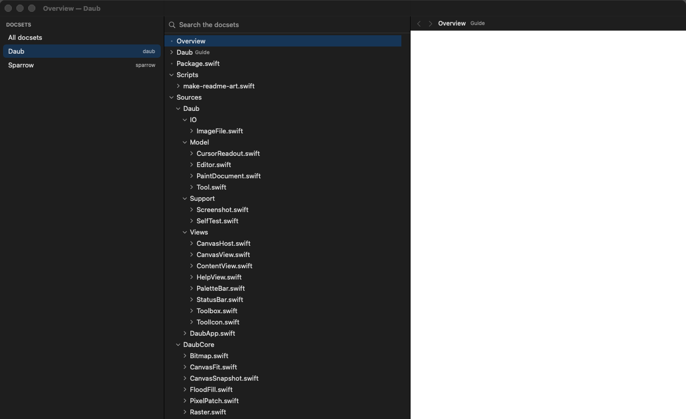
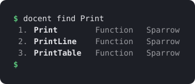
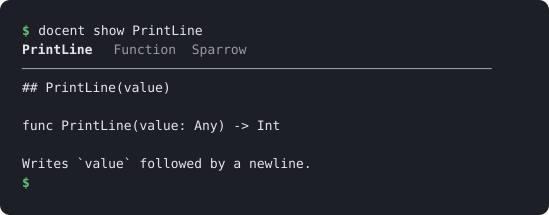

# Docent

**Read offline documentation sets on a Mac — in a window, or straight from the terminal.**

<p align="center"></p>

Docsets are the offline documentation format used by Dash and Zeal: a folder with an index
and a tree of HTML pages. Docent opens the ones you already have — no account, no
subscription, nothing downloaded behind your back — and gives you one search across all of
them, in an app and in a command you can pipe.

- **Search** every docset at once, exactly or loosely: `NSPast` finds `NSPasteboard`.
- **Read** a symbol's page in the window, pictures and all, or print it as text with
  `docent show`.
- **Index your own project**: point the app (⇧⌘I) or `docent browse` at a repository and
  both halves of it become searchable — the Markdown *and* the code, every type, function,
  method and property with the documentation comment written above it.
- **Read comfortably.** Pages are painted to match the app — light or dark, your choice —
  and code blocks are syntax-highlighted even when the docset ships them plain.
- **Keep it offline.** Docent never opens a network connection, and pages you read cannot
  either.

One Swift binary and one app bundle, no runtime dependencies, macOS 14 or later.

## Contents

- [Install](#install)
- [Quick start](#quick-start)
- [Getting docsets](#getting-docsets)
- [A tour](#a-tour)
- [Keyboard](#keyboard)
- [Getting help](#getting-help)
- [Command reference](#command-reference)
- [What it touches](#what-it-touches)
- [Limits](#limits)
- [License](#license)

## Install

From a checkout, with the Xcode command line tools installed:

```sh
make install
```

That builds `Docent.app` into `/Applications` and the `docent` command into
`/usr/local/bin`. Both destinations can be moved:

```sh
DOCENT_APP_DIR=~/Applications DOCENT_BIN_DIR=~/.local/bin make install
```

`make` alone builds both into `./build` without installing anything.

## Quick start

```sh
docent browse ~/code/myproject    # index a project and read it in the window
docent add ~/Downloads/Go.tgz     # put a docset in your library
docent list                       # what is installed
docent find Println               # search every docset
docent show go:Println            # print the documentation as text
open -a Docent                    # the whole library, in a window
```

`docent browse` is the short way in: it makes a docset out of the folder if there is not
one yet, opens Docent, and shows that project with everything in it listed. Run it again
later with `--replace` to pick up new files.

## Getting docsets

Docent reads docsets; it does not host or sell them. Three ways to get one:

- **You already have them.** If Dash or Zeal is installed, Docent reads their docset
  folders as they are — nothing to copy.
- **Download one** from the docset feeds those apps use, then add the archive:
  `docent add ~/Downloads/Python_3.tgz`.
- **Index a folder you have**: `docent browse ~/code/myproject` (or `docent index`, or
  ⇧⌘I in the app) walks it for documentation and for code, and installs the result. Your
  own project then searches like any other docset.
- **Build one from generated docs** with [doc2dash](https://github.com/hynek/doc2dash),
  which turns Sphinx, MkDocs and similar output into a docset:
  `doc2dash -n MyLib docs/_build/html && docent add MyLib.docset`.

## A tour

### 1. Find something

`docent find` searches every installed docset and puts the best answer first: an exact
name, then names that start with what you typed, then names that merely contain it, then a
loose letters-in-order match for when you only half-remember it.

<p align="center"></p>

Narrow it to one docset with its keyword — `docent find go:Println` — or with
`--docset go`.

### 2. Read it without leaving the terminal

`docent show` prints the documentation as text. When a docset points at one symbol on a
long page, you get that section rather than the whole file; `--all` gives you the page.

<p align="center"></p>

`docent find --json` prints the same results as JSON, and `docent path` prints the file a
symbol lives in, so you can hand it to something else.

### 3. Index a repository

One command, from a folder to a window you can read:

```sh
docent browse ~/code/myproject
```

It indexes the project if it has not been indexed yet, opens Docent, and selects it with
everything in it listed — so you can scroll the documentation without typing a search at
all. Come back to it the same way any time; add `--replace` when the files have moved on.

**Your code is indexed too**, which is most of what a repository is. Swift, Python, Go,
Rust, JavaScript and TypeScript files become pages of their declarations: every type,
function, method, property and enum case is an entry, carrying the documentation comment
written above it and the line it is on.

```sh
docent find mine:Canvas.draw      # the method, wherever it lives
docent show mine:Canvas           # its declaration and its doc comment
docent find mine:clipboard        # a word that appears only inside a function body
```

That last one works because whole files are indexed as text as well: when nothing is
*called* what you typed, Docent looks inside the pages and shows the ones that mention it,
with the line it found. Use `--docs-only` if you want the Markdown and nothing else.

In the app instead: **File ▸ Index Folder…** (⇧⌘I), pick a repository, and it appears in
the sidebar when it is done. Choosing a folder that is already indexed offers to rebuild
it.

And for the terminal alone, `docent index` installs a docset without opening anything:

```sh
docent index ~/code/myproject --name "My Project" --keyword mine
docent find mine:install
```

Pictures come with it: a screenshot or diagram a page points at is copied into the docset
and shown where it belongs, so a README that opens with a screenshot still does. Images
hosted on the web are not fetched — Docent stays offline — and appear as their caption.

Every Markdown and HTML file becomes a page and every heading becomes an entry, so
`docent show mine:"Running the tests"` prints that section and nothing else. Docsets built
this way are also searchable by **text**: when nothing is *called* what you typed, Docent
looks inside the pages and shows the ones that mention it, with the line it found —
`docent find mine:clipboard`, or `--text` to search that way from the start. Build folders,
`.git`, `node_modules` and the like are skipped, symlinks are not followed, and the folder
you point at is never modified. `--out PATH` writes the docset somewhere instead of
installing it.

### 4. Or in a window

The app opens on the search field. Type, move through the results with the arrow keys
without leaving the field, and the page appears beside them. The docsets on the left narrow
the search to one at a time.

Pages are repainted for reading rather than shown as the docset's own stylesheet left them:
white with near-black text, or a dark ground with light text, whichever matches the app —
and **View ▸ Page Appearance** pins it to light or dark if you would rather choose. Code
blocks a docset ships without colour are highlighted; blocks it already coloured are left
exactly as they are.

## Keyboard

| Key | What it does |
|---|---|
| ⌘F | back to the search field |
| ↑ / ↓ | move through the results while you keep typing |
| ⌘[ / ⌘] | back and forward through what you have read |
| ⇧⌘I | index a folder of documentation |
| ⌘R | look for docsets again after adding one |

Page colours live in **View ▸ Page Appearance**: match the system, or pin pages light or
dark. Docent remembers the choice.

## Getting help

```sh
docent --help            # the commands, with examples
docent help find         # one command in full
docent find --help       # the same thing
```

## Command reference

| Command | What it does |
|---|---|
| `docent list` | the docsets Docent can see, with their keywords and sizes |
| `docent find <query>` | search every docset; `--limit`, `--docset`, `--text`, `--json` |
| `docent show <query>` | print a symbol's documentation as text; `--all`, `--index N` |
| `docent path <query>` | print the file (and anchor) a symbol lives in |
| `docent add <path>` | install a `.docset` folder or a `.tgz` archive; `--replace` |
| `docent index <folder>` | make a docset from a folder of documentation and code; `--name`, `--keyword`, `--out`, `--replace`, `--docs-only` |
| `docent browse [folder]` | index the folder if needed, then open it in the window; `--name`, `--keyword`, `--replace`, `--docs-only` |

## What it touches

Docent installs docsets into `~/Library/Application Support/Docent/DocSets`, and that is
the only place it writes. It reads:

- that folder,
- `~/Library/Application Support/Dash/DocSets` and `~/.local/share/Zeal/Zeal/docsets`, so
  docsets you already have just appear,
- whatever `DOCENT_DOCSETS` names, if you set it (a colon-separated list of folders, which
  replaces all three).

`docent browse` leaves one small file beside the docsets (`.open-request.json`) saying
which docset the window should open; Docent reads it once and deletes it.

`docent index` reads the folder you point it at — skipping `.git`, build folders and
symlinks — and writes only the new docset. It never writes to a docset, never deletes one you
did not ask it to replace, and never opens a network connection. Pages you read cannot either: JavaScript is off, remote images,
stylesheets and fonts are blocked, and a link to the web opens in your own browser instead
of loading inside Docent. A docset that points at a file outside itself is refused rather
than followed.

## Limits

- macOS 14 or later, and docsets in the Dash format. Other documentation formats need
  converting first (see [doc2dash](https://github.com/hynek/doc2dash)).
- Pictures a page links to on the web are not downloaded, and a picture larger than 16 MB
  is left where it is.
- Code is read by pattern, not compiled: Swift, Python, Go, Rust, JavaScript and TypeScript
  are understood, other languages are indexed as text only, and an unusual declaration can
  be missed. Nothing is resolved across files — Docent shows you where something is
  declared, not everywhere it is used.
- No docset catalogue or downloader: you bring the docsets.
- `docent show` renders a page as plain text. Tables come out as rows, diagrams and images
  do not come out at all — read those in the window.
- Search is over symbol names. The text of the pages is searchable only for docsets built
  with `docent index` — a docset from elsewhere carries an index of names and nothing else.
- Syntax highlighting is a general-purpose guess, not a parser per language: it colours
  comments, strings, numbers, common keywords and capitalised names. A docset that already
  highlights its own code keeps its own colours.

## License

[MIT](LICENSE): use it, change it, share it, sell it. Keep the copyright notice.
